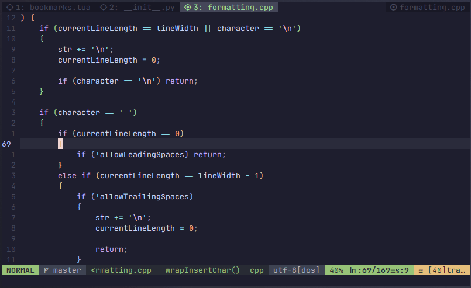

<h1 align="center">🔖 bookmarks.nvim</h1>
<p align="center">Bookmark, go away, and go back. No stress involved.</p>

---

Most coders have those recurring files they come back to over and over again
from time to time. For some, the solution is to remember the file's path and
use it to return there every time, and that's fine when you have one file, but
it becomes a problem when the number scales up, so I present you **Bookmarks**.

Bookmarks is a Neovim plugin that allows you to create named bookmarks for
files and go back to them using their name (even between sessions).

🌟 Works out of the box: No dependencies.
🌟 Lightweight: single file, simple structure, no bloat.
🌟 Intuitive, mnemonic approach to keybindings.
🌟 Less overhead for your brain; let your computer remember file paths for you.



## Getting Started

Install:

- Using [packer.nvim](https://github.com/wbthomason/packer.nvim):
```lua
use 'volatusveritas/bookmarks.nvim'
```

- Using [vim-plug](https://github.com/junegunn/vim-plug):
```vim
Plug 'volatusveritas/bookmarks.nvim'
```

And then get it ready:

- With Lua:
```lua
require("bookmarks")
```

- With Vimscript:
```vim
lua << EOF
    require("bookmarks")
EOF
```

## Default Keybindings

- `gbg` for "bookmark go": prompts the user to jump to a bookmark by its name.
- `gbx` for "bookmark go split": same as "bookmarks go", but opens the bookmark
  in a horizontal split instead of the current buffer.
- `gbv` for "bookmark go vsplit": same as "bookmark go", but opens the
  bookmark in a vertical split instead of the current buffer.
- `gbt` for "bookmark go tab": same as "bookmark go", but opens the bookmark in
  a new tab instead of the current buffer.
- `gbm` for "bookmark make": makes a new bookmark out of the current file.
- `gbl` for "bookmark list/look": emits the list of registered bookmarks.
- `gbL` for "bookmark List/Look": emits the list of registered
  bookmarks with the paths associated with them.
- `gbd` for "bookmark delete": prompts the user to delete a bookmark.
- `gbb` for "bookmark backup": creates a backup file of the currently
  registered bookmarks.
- `gbB` for "bookmark Backup": same as "bookmark backup" but deletes old
  backups before backing up.
- `gbR` for "bookmark Reset": resets the current list of bookmarks (you may
  want to "bookmark backup" before doing this).
- `gbw` for "bookmark write": writes the current state of bookmarks to the
  bookmarks file.

Note: Bookmarks runs "bookmark write" when exiting, so you won't lose your
bookmarks when exiting.
